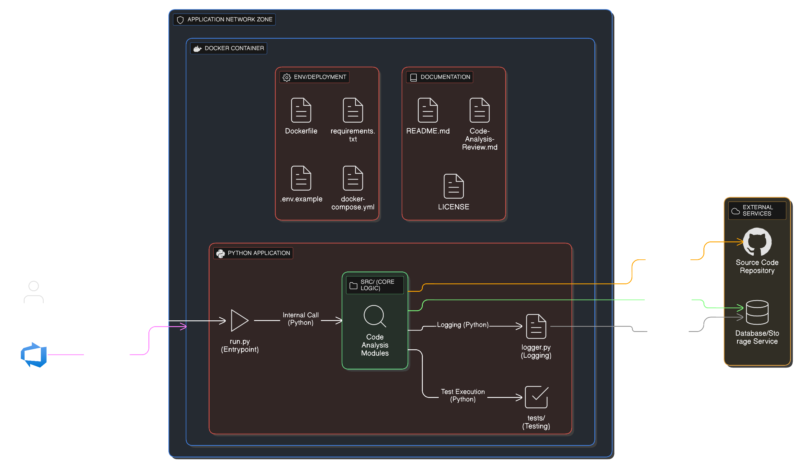

# Code Analysis Prototype - Developer Handbook

**Analysis Date:** 2025-11-23T05:55:14.713Z
**Branch:** main
**Total Files Analyzed:** 0

---

# AI-Powered Query Processing Backend: Comprehensive Handbook

## 1. Executive Summary (Business Level)

### What the Software Does
This system provides an AI-driven backend for advanced query processing, context detection, and information retrieval. It leverages modular AI agents, prompt engineering, and vector embeddings to interpret user queries, generate relevant responses, and improve access to information. The backend exposes API endpoints for external systems or user interfaces to submit queries and receive AI-generated results.

### Business Value and Purpose




The platform enables organizations to harness the power of AI for natural language query understanding, context-aware information retrieval, and intelligent response generation. By modularizing AI agent logic and supporting vector-based retrieval, the system can be extended for various domains, such as knowledge management, customer support, or intelligent search.

### Key Features and Capabilities
- Modular AI agent architecture for context detection, query generation, and improvement
- Prompt engineering and tool orchestration for flexible AI workflows
- Vector embedding generation for semantic search and retrieval
- RESTful API endpoints for seamless integration
- Authorization and validation mechanisms for secure and reliable operation
- Docker-based deployment for portability and scalability

### Target Users and Use Cases
- End users seeking intelligent query responses via integrated applications
- Developers extending AI agent capabilities or integrating with new data sources
- System integrators embedding the backend into larger platforms or workflows

### Business Impact and Outcomes
- Enhanced information access and retrieval through AI-driven understanding
- Reduced manual effort in query interpretation and response generation
- Scalable, extensible backend for evolving business needs

## 2. System Overview (All Levels)

### High-Level Architecture Explanation
The system is organized into modular domains:
- **AI/ML Logic**: Implements AI agents, prompt engineering, and embedding generation
- **Backend API**: Exposes RESTful endpoints for query submission and response retrieval
- **Data Access Layer**: Manages metadata and integrates with MongoDB for storage
- **Utilities and Configuration**: Provides helper functions, configuration management, and validation logic

### System Capabilities and Functionality
- Accepts user queries via API endpoints
- Validates and authorizes incoming requests
- Routes requests to appropriate AI agents for processing
- Performs context detection, relevance checking, and query improvement
- Generates or retrieves vector embeddings for semantic search
- Returns formatted responses to users

### How the System Works (Conceptual Flow)
1. User submits a query to the API
2. API validates and authorizes the request
3. Request is routed to an AI agent
4. Agent performs context detection and relevance checking
5. Agent may invoke LLMs or embedding generators as needed
6. Results are formatted and returned to the user

### Key Components and Their Roles
- **AI Agents**: Core logic for interpreting and processing queries
- **API Routes**: Entry points for external requests
- **Database Access**: Manages metadata and persistent storage
- **Embedding Generation**: Supports vector-based retrieval
- **Utilities**: Helper functions and validation logic

## 3. Detailed Architecture (Architect & Developer Level)

### Complete Architecture Pattern Explanation
The architecture follows a modular, service-oriented pattern with clear separation of concerns. AI/ML logic is encapsulated in agent modules, while backend API routes handle external communication. Data access and embedding generation are isolated in dedicated modules, promoting maintainability and extensibility.

### Technology Stack Breakdown
- **Languages**: Python
- **Frameworks**: Python/pip
- **AI/ML Frameworks**: AI Agent Framework, Prompt Engineering, Vector Embeddings
- **Databases**: MongoDB
- **Infrastructure**: Docker, Docker Compose

### System-Level Design Decisions
- Modular agent design for extensibility
- Use of vector embeddings for semantic search
- RESTful API for integration
- Docker-based deployment for consistency

### Scalability and Performance Considerations
- Modular components allow for independent scaling
- Vector embeddings enable efficient retrieval
- Dockerization supports horizontal scaling

### Integration Points
- API endpoints for external integration
- MongoDB for persistent storage
- Embedding generators for AI workflows

## 4. Component Details (Developer & Architect Level)

### AI Agents (src/ai/agents)
- **Purpose**: Implements context detection, query generation, improvement, and relevance checking
- **Implementation**: Custom agent classes, prompt templates, tool interfaces
- **Key Files**:
  - `context_detection_agent.py`: Context detection logic
  - `improvement_agent.py`: Query improvement logic
  - `query_generation_agent.py`: Query generation logic
  - `check_relevance.py`: Relevance checking logic
  - `prompts.py`: Prompt templates and management
  - `tools.py`: Tool integration
- **Data Structures**: Agent classes, prompt templates
- **Error Handling**: Fallback strategies for failed LLM/tool calls
- **Dependencies**: AI/ML frameworks, utility modules

### AI Configuration (src/ai/config)
- **Purpose**: Centralized configuration management
- **Implementation**: Configuration classes and dictionaries
- **Key Files**:
  - `config.py`: Configuration logic
- **Error Handling**: Validation and error reporting for invalid settings

### AI Graphs (src/ai/graphs)
- **Purpose**: Workflow orchestration for agent execution
- **Implementation**: Graph structures, node definitions
- **Key Files**:
  - `graph_builder.py`: Graph construction logic
  - `graph_executor.py`: Graph execution logic
- **Error Handling**: Handles errors in graph execution

### LLM Integration (src/ai/llm)
- **Purpose**: LLM invocation and guard logic
- **Implementation**: LLM interface classes
- **Key Files**:
  - `llm.py`: LLM interface
  - `guard.py`: Guard logic for LLM calls
- **Error Handling**: Handles LLM failures and guard violations

### Backend API (src/backend/routes)
- **Purpose**: API routing and request handling
- **Implementation**: Route handlers, request validation
- **Key Files**:
  - `query.py`: Implements `/api/query` endpoint
  - `__init__.py`: API initialization
- **Data Structures**: Request/response schemas
- **Error Handling**: Input validation and exception handling

### Database Access (src/backend/db)
- **Purpose**: Metadata management and MongoDB integration
- **Implementation**: Metadata schemas, MongoDB models
- **Key Files**:
  - `metadata.py`: Metadata logic
  - `mongodb.py`: MongoDB access logic
- **Error Handling**: Database connection and data validation errors

### Embedding Generation (src/backend/embedding)
- **Purpose**: Embedding generation for vector retrieval
- **Implementation**: Embedding vector logic
- **Key Files**:
  - `embedding.py`: Embedding generation logic
- **Error Handling**: Handles embedding generation failures

### Schema Definitions (src/backend/schema)
- **Purpose**: API request/response schema definitions
- **Implementation**: Schema classes
- **Key Files**:
  - `query.py`: Query schema
- **Error Handling**: Validation errors

### Validators (src/backend/validators)
- **Purpose**: Input validation logic
- **Implementation**: Validator classes
- **Key Files**:
  - `validators.py`: Validation logic
- **Error Handling**: Validation error reporting

### Utilities (src/ai/utils, src/backend/utils)
- **Purpose**: Helper functions, role management, metadata extraction
- **Implementation**: Utility functions and classes
- **Key Files**:
  - `helpers.py`, `role.py`: AI utilities
  - `metadata_extractor.py`, `misc.py`: Backend utilities
- **Error Handling**: Error handling within utility functions

## 5. How It Works (All Levels)

### 5.1 User Request Flow (Step-by-Step)
1. User submits a query to `/api/query` (src/backend/routes/query.py)
2. API route validates the request and checks authorization (src/backend/validators/validators.py)
3. Request is routed to the appropriate AI agent (src/ai/agents)
4. Agent performs context detection and relevance checking (src/ai/agents/generation/context_detection_agent.py, check_relevance.py)
5. If necessary, agent invokes LLM or embedding generator (src/ai/llm/llm.py, src/backend/embedding/embedding.py)
6. Results are formatted and returned to the user (src/backend/routes/query.py)

### 5.2 LangGraph/Agent State Machine Flow
- **Nodes**: Context detection, query generation, improvement, relevance checking
- **Edge Conditions**: Based on agent outputs (e.g., if context detected, proceed to query generation)
- **State Updates**: Agent state updated at each node
- **Tool Calls**: Invoked as needed by agents
- **Flow Example**: Query → Context Detection → Query Generation → Improvement → Relevance Check → Response

### 5.3 Decision Logic
- **Cache Lookup**: Not explicitly found in code
- **LLM Invocation**: Called by agents when needed (src/ai/llm/llm.py)
- **Database Query Generation**: Managed by agents and backend/db modules
- **Agent Selection**: Based on request type and agent logic
- **Error Handling**: Input validation, agent/tool fallback

### 5.4 Request/Response Patterns
- **Request**: JSON payload to `/api/query`
- **Response**: JSON-formatted AI-generated result
- **Data Transformations**: Request → Validation → Agent Processing → Response

### 5.5 Data Flow Through System
- User Query → API Route → AI Agent → LLM/Embedding/DB → Response Formatter → User

### 5.6 Business Workflows
- Query processing and response generation

### 5.7 Error Handling Flows
- Input validation errors returned to user
- Agent/tool failures handled with fallback logic

### 5.8 State Management
- Agent state maintained during request processing

## 6. API Documentation (Developer Level)

### Endpoints
- **POST /api/query** (src/backend/routes/query.py)
  - **Parameters**: JSON body (see src/backend/schema/query.py)
  - **Request Format**: JSON
  - **Response Format**: JSON
  - **Authentication**: Authorization enforced (see detected security mechanisms)
  - **Error Responses**: Validation errors, authorization errors, processing errors
- **/api/__init__** (src/backend/routes/__init__.py)
  - API initialization

### Request/Response Formats
- **Request Example**:
  ```json
  {
    "query": "What is the capital of France?"
  }
  ```
- **Response Example**:
  ```json
  {
    "result": "Paris"
  }
  ```

### Authentication Mechanisms
- Authorization enforced at API layer

### Rate Limiting
- Not found in code

### Error Responses
- Validation errors returned as JSON

### API Versioning


- Not found in code

## 7. Data Architecture (Architect & Developer Level)

### Database Schemas and Relationships
- **MongoDB** used for metadata storage (src/backend/db/mongodb.py)
- **Metadata schemas** defined in src/backend/db/metadata.py

### Data Access Patterns
- Direct access via MongoDB models and helper functions

### Caching Strategies
- Not found in code

### Data Validation Rules
- Implemented in src/backend/validators/validators.py and schema definitions

### Migration Strategies
- Not found in code

### Backup and Recovery
- Not found in code

### Data Flow Patterns


- Query → Validation → Agent Processing → Embedding/DB → Response

## 8. Design Patterns (Architect Level)

### Patterns Used and Why
- Modularization: Each domain (AI agents, backend, utils) is isolated for maintainability
- Service-Oriented: API routes act as service entry points
- Agent Pattern: AI logic encapsulated in agent classes

### Architectural Decisions and Trade-Offs
- Modular design for extensibility
- Use of vector embeddings for semantic search

### Pattern Interactions
- Agents interact with tools and LLMs via defined interfaces

### Code Examples
- Agent classes in src/ai/agents/generation/
- API route handlers in src/backend/routes/query.py

### Pattern Locations
- src/ai/agents, src/backend/routes

## 9. Security (All Levels)

### Security Mechanisms
- Authorization enforced at API layer (detected in code)

### Authentication and Authorization
- API requests require authorization

### Data Protection
- Not found in code

## 10. Development Guide (Developer Level)

### Setup and Installation
- **Prerequisites**: Python, Docker
- **Installation**:
  1. Clone repository
  2. Install dependencies via `pip install -r requirements.txt`
  3. Configure environment variables (see .env.example)
  4. Start services with Docker Compose (`docker-compose up`)

### Configuration
- Configuration files in src/ai/config/config.py and .env.example

### Running Tests
- Test files in tests/

### Debugging Tips
- Use logger.py for debugging output

### Common Issues
- Missing environment variables
- Docker service failures

## 11. File Map (All Levels)

### Repository Layout
```
/
├── .dockerignore
├── .env.example
├── .gitignore
├── azure-pipelines.yml
├── backupfile.yml
├── Code-Analysis-Review.md
├── docker-compose.yml
├── Dockerfile
├── LICENSE
├── logger.py
├── README.md
├── requirements.txt
├── run.py
├── src/
│   ├── ai/
│   │   ├── agents/
│   │   │   ├── generation/
│   │   │   │   ├── context_detection_agent.py
│   │   │   │   ├── improvement_agent.py
│   │   │   │   ├── query_generation_agent.py
│   │   │   │   ├── sample_queries.py
│   │   │   │   └── __init__.py
│   │   │   ├── misc/
│   │   │   │   ├── check_relevance.py
│   │   │   │   └── __init__.py
│   │   │   ├── prompts/
│   │   │   │   ├── prompts.py
│   │   │   │   └── __init__.py
│   │   │   ├── tools/
│   │   │   │   ├── tools.py
│   │   │   │   └── __init__.py
│   │   │   └── __init__.py
│   │   ├── config/
│   │   │   ├── config.py
│   │   │   └── __init__.py
│   │   ├── graphs/
│   │   │   ├── graph_builder.py
│   │   │   ├── graph_executor.py
│   │   │   └── __init__.py
│   │   ├── llm/
│   │   │   ├── guard.py
│   │   │   ├── llm.py
│   │   │   └── __init__.py
│   │   ├── state/
│   │   │   ├── generation_state.py
│   │   │   └── __init__.py
│   │   ├── utils/
│   │   │   ├── helpers.py
│   │   │   ├── role.py
│   │   │   └── __init__.py
│   │   └── __init__.py
│   ├── backend/
│   │   ├── config/
│   │   │   ├── config.py
│   │   │   └── __init__.py
│   │   ├── db/
│   │   │   ├── metadata.py
│   │   │   ├── mongodb.py
│   │   │   └── __init__.py
│   │   ├── embedding/
│   │   │   ├── embedding.py
│   │   │   └── __init__.py
│   │   ├── models/
│   │   │   └── __init__.py
│   │   ├── routes/
│   │   │   ├── query.py
│   │   │   └── __init__.py
│   │   ├── schema/
│   │   │   ├── query.py
│   │   │   └── __init__.py
│   │   ├── utils/
│   │   │   ├── metadata_extractor.py
│   │   │   ├── misc.py
│   │   │   └── __init__.py
│   │   ├── validators/
│   │   │   ├── validators.py
│   │   │   └── __init__.py
│   │   └── __init__.py
│   └── __init__.py
├── tests/
│   ├── tests.py
│   └── __init_.py
```

### Key Files by Component
- **AI Agents**: src/ai/agents/generation/context_detection_agent.py, improvement_agent.py, query_generation_agent.py
- **API Routes**: src/backend/routes/query.py
- **Database Access**: src/backend/db/metadata.py, mongodb.py
- **Embedding Generation**: src/backend/embedding/embedding.py
- **Utilities**: src/ai/utils/helpers.py, src/backend/utils/metadata_extractor.py

## Troubleshooting and Best Practices
- Ensure all environment variables are set (see .env.example)
- Use Docker Compose for consistent environment
- Validate API requests against schemas
- Extend agents by following modular design patterns

## Architecture Diagram Description
See diagramDescriptions.architectureDiagram for a detailed prompt.


## Additional Diagrams

*Additional diagrams generated via Eraser.io*

### Architecture Diagram


### Component/Class Diagram


### Sequence Diagram


### Code Flow Diagram


